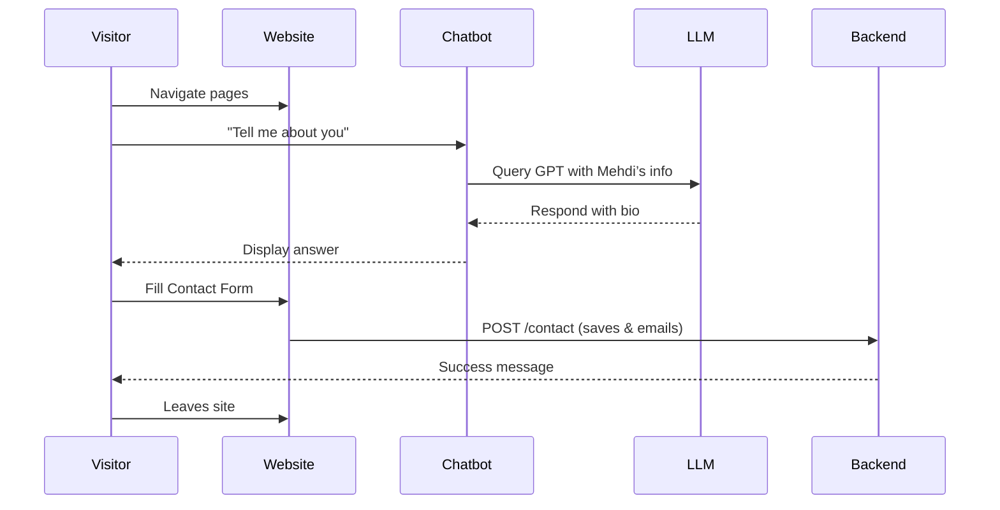
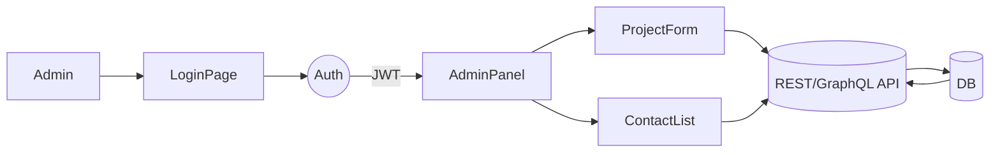

# Project Plan: Dynamic Portfolio Website for Mehdi Abbas Nathani

## Executive Summary  
This project will deliver a modern, dynamic portfolio website showcasing Mehdi’s skills, projects (including **BIDLY** and **Hospital Receptions Replace**), experience, and certifications (including Next.js, OpenAI Agents SDK, Prompt Engineering). The site will include a **secure admin dashboard (CMS)** for content management, an AI-powered **chatbot widget** for visitor Q&A and service requests, and a **contact form**. Key deliverables are: a comprehensive site architecture, detailed feature set, data model design, UX flows, tech-stack comparison, hosting/security/SEO plan, analytics and accessibility guidelines, and an implementation roadmap with milestones. We will use Next.js (for fast SSR/SSG) and a headless backend (e.g. Supabase) to balance performance and ease of development. The chatbot will leverage a large language model (LLM) with retrieval-augmented generation (RAG) for up-to-date responses. Citations from portfolio development guides and examples are included to support these choices【51†L62-L69】【50†L467-L474】.

## User Profile & Requirements  
Mehdi’s background: MBA in Finance, now a “passionate Flutter developer” transitioning into software (with ~10+ years professional experience in finance/automation)【56†L227-L229】. His skills include Flutter/Dart, Python, Firebase, VBA, etc. The site should highlight both his technical skills and finance experience. Provided context updates include his work at *IVISIATE GATE*, projects *BIDLY* and *Hospital Receptions Replace*, and new certifications (Next.js, OpenAI Agents, Prompt Engineering). Based on his GitHub **About Me**, key focal areas are mobile app projects and automation tools【56†L227-L229】. 

**Key Goals:** Showcase Mehdi’s portfolio with dynamic content; allow him to edit content via an admin CMS; offer an interactive **chatbot** for visitor queries; ensure accessibility, SEO, and strong security. 

## Site Structure & Features  

- **Public Portfolio (Frontend):** A responsive, SEO-friendly Next.js website. Key pages:
  - **Home:** Hero section (name, tagline, image) with navigation.
  - **About Me:** Bio (finance and dev background), headshot, download CV link.
  - **Skills:** Charts or lists of technical skills (Flutter, Next.js, Python, AI/ML, Excel/VBA, etc.) and proficiencies.
  - **Projects:** Gallery/list of projects, each with title, description, tech stack, links (GitHub/demo). Include *BIDLY* and *Hospital Receptions Replace* as featured projects, and mobile finance apps or team projects.
  - **Experience:** Timeline of jobs/roles (e.g. IVISIATE GATE), descriptions.
  - **Certifications:** List certificates with issuer and date (e.g. “Next.js – SMIT – 2025”).
  - **Contact:** Form (name, email, message) that stores inquiries and emails Mehdi. Include social links.
  - **(Optional Blog):** If Mehdi writes tech or AI articles, a blog listing with detail pages. Improves SEO and shows expertise.

- **Chatbot Widget:** A floating chat interface (bottom-right corner) allowing visitors to ask about Mehdi or request services. The bot will fetch answers from a knowledge base (Mehdi’s bio, project descriptions, etc.) or use an LLM (e.g. OpenAI GPT-4) with proper prompts【50†L467-L474】. The chatbot can handle FAQs (“Tell me about yourself”, “What services do you offer?”) and guide users to contact or schedule services. As one guide notes, adding a chatbot “significantly enhance[s] user engagement” and showcases dynamic, user-centric design【50†L467-L474】.

- **Admin Dashboard (CMS):** A protected backend interface (login required) where Mehdi can **add/edit/delete** content: projects, experiences, skills, certifications, and view contact messages. This turns the portfolio into a personal CMS, enabling real-time updates without redeploying【52†L110-L115】. The dashboard should support:
  - **Authentication:** Secure admin login (JWT/OAuth).
  - **Content Forms:** CRUD forms for each data type (project, etc.) with validation and image upload.
  - **Contact Management:** List of contact form submissions and ability to mark/respond.
  - **Rich Text/Markdown:** For blog or project descriptions.
  - **Media Management:** Upload and manage images (project screenshots, profile photo).
  - Example features drawn from guides: a modern portfolio with admin CMS includes authentication and responsive design【51†L62-L69】, contact form handling【51†L62-L69】, and real-time updates【51†L62-L69】.

- **Shared Features:** Responsive mobile-first design, smooth animations (e.g. on project gallery), and consistent branding. Use semantic HTML5 for accessibility【60†L273-L281】, and ensure clear navigation and form labels. Include analytics scripts (e.g. Google Analytics) and SEO tags (meta descriptions, Open Graph).

## Data Models (Table)  

| **Entity**       | **Attributes**                                      | **Description**                                  |
|------------------|-----------------------------------------------------|--------------------------------------------------|
| **User/Admin**   | id, username, passwordHash, role (enum: admin)      | Admin credentials for CMS access.                |
| **Project**      | id, title, description, techStack, linkGithub, linkLive, imageURL, featured (bool), dateCreated/updated | Portfolio projects with details and images.      |
| **Skill**        | id, name, category (e.g. “Framework”, “Language”), proficiency (string or number) | Measurable skills for display (charts or lists). |
| **Experience**   | id, company, role, startDate, endDate (or current), responsibilities (text) | Work history entries.                            |
| **Certification**| id, name, issuer, date, credentialURL             | Certifications and courses (e.g. “Next.js – SMIT – 2025”). |
| **ContactMessage** | id, name, email, message, dateSubmitted, status (enum: new/read/replied) | Stored messages from contact form.              |
| **BlogPost** (opt.) | id, title, slug, excerpt, content, datePublished, tags (list), imageURL | (If blogging) posts for knowledge sharing.    |
| **ChatHistory** (opt.) | id, sessionID, question, answer, timestamp   | (Optional) Logs of chatbot interactions.         |

*Table: Core data models for the portfolio’s dynamic content (designed for a database such as PostgreSQL or MongoDB, and editable via the admin dashboard).*

## User & Admin UX Flows  

- **Visitor Flow:** A user lands on Home → navigates to sections (About, Projects, etc.) → if they have questions, they open the chatbot → chatbot answers (or directs to Contact form)【50†L467-L474】. To contact Mehdi, visitor fills the form on Contact page. Data is submitted to backend (email and/or DB).
- **Admin Flow:** Admin navigates to `/admin` (login page) → enters credentials → upon success, sees a dashboard menu (e.g. Projects, Skills, Contact). Admin can click *Add Project*, fill form (title, desc, images), and submit to update DB【51†L62-L69】【52†L110-L115】. After saving, frontend pages automatically update. Similar flows for editing skills, certs, etc. Contact messages appear in a table to mark as “read” or “replied”.





## Chatbot Design (RAG & Integration)  

The chatbot will be powered by an LLM (e.g. OpenAI GPT-4 or Google Gemini). To keep answers relevant to Mehdi’s profile, use **Retrieval-Augmented Generation (RAG)**: index Mehdi’s static content (about text, projects descriptions, FAQs) in a vector store (e.g. pgvector or Pinecone). On user query, fetch relevant chunks via similarity search, then include them in the LLM prompt. This ensures the bot knows Mehdi’s data and remains up-to-date. For example, **Neon.tech’s RAG portfolio** uses Postgres with vector search for a Next.js chatbot【29†L3-L11】. If full RAG is overkill, a simpler approach is using GPT prompts that embed Mehdi’s bio snippet and training Q&A pairs. 

Implementation steps:
- Prepare content (Mehdi’s bio, project descriptions, service offerings).
- Build or use a vector database (e.g. Supabase pgvector, or external like Pinecone).
- Upon chat input, query vectors + original message, send to LLM API.
- Return and display the answer. The UI should show chat bubbles (colored differently for user and bot)【50†L467-L474】. Follow UI best practices (e.g. open chat from bottom corner). Ensure chat widget can fade out and not obstruct content (Packt tutorial suggests bottom-right positioning)【50†L467-L474】.
- For “service request”, bot can trigger an email notification or link to the Contact form. Maintain user privacy – do not store sensitive data.

## Technology Stack Options  

| **Component**         | **Option 1**                   | **Option 2**                 | **Option 3**                |
|-----------------------|-------------------------------|-----------------------------|----------------------------|
| **Frontend Framework**| **Next.js (React)** – SSR/SSG for SEO (fast first load, Google indexing)【54†L66-L72】. Modern features (App Router, ISR). TypeScript supported. Large ecosystem.  | Gatsby (React SSG) – good SEO, but less dynamic.  | Plain React SPA – simpler but worse SEO and initial load. |
| **Backend/API**       | **Supabase** – Managed Postgres + Auth + Storage. “Eliminates need to maintain a custom backend server”【54†L107-L112】. Auto APIs, real-time, easy user auth.  | Firebase (Firestore) – Real-time DB, easy auth (Google). But NoSQL structuring of relational data like projects is harder. Also vendor lock-in.  | **Custom** (Node/Express or FastAPI) – Full control (e.g. use Python skills), but requires more work for auth, hosting. |
| **Database**          | PostgreSQL (via Supabase) – Relational, supports embeds vector search (pgvector).  | MongoDB – NoSQL, flexible (e.g. as Dev article used)【51†L62-L69】.  | SQLite – simple but not ideal for web-scale.  |
| **Authentication**    | Supabase Auth – built-in with email/OAuth.  | NextAuth.js – flexible OAuth (Github, Google).  | Firebase Auth – easy, many providers.  |
| **Chatbot (LLM)**     | OpenAI GPT-4 – industry-leading, easy API.  | Google Gemini API – strong LLM (if available).  | Open-source LLM (e.g. Llama) – requires hosting and may lack knowledge.  |
| **Hosting/CDN**       | Vercel – optimal for Next.js (built-in CI/CD, serverless functions). Used by portfolio examples【52†L119-L124】.  | Netlify – similar (SSG + serverless).  | AWS/GCP (S3 + Cloud Functions) – more custom.  |
| **Email Service**     | SendGrid or Amazon SES – for contact form emails.  | Nodemailer (via SMTP) – simpler but less scalable.  | -  |
| **Storage (images)**  | Supabase Storage or AWS S3 – for uploaded images.  | Firebase Storage – if using Firebase.  | Local file storage (not recommended in cloud). |
| **CMS Framework**     | Build in Next.js admin pages (React).  | Use Strapi or Keystone – headless CMS with UI.  | Sanity CMS – managed content studio (free tier). |
| **Analytics**         | Google Analytics or Plausible (privacy-friendly).  | -  | -  |
| **CI/CD**            | GitHub Actions or built-in Vercel pipelines. |  |  |

*Table: Tech stack options and trade-offs. The chosen stack (e.g. Next.js + Supabase + Vercel + OpenAI GPT-4) balances development speed, scalability, and performance【54†L107-L112】【52†L119-L124】.*

## Hosting, Security, Performance & SEO  

- **Hosting & CDN:** Deploy the Next.js site on Vercel (recommended) for its global edge network (low latency) and automatic SSL. Use Vercel functions for API routes (if not using an external API). Store uploaded media in cloud (Supabase Storage or AWS S3) and serve via CDN. This setup (Next.js + Vercel) was used in dynamic portfolio examples【52†L119-L124】.

- **Performance:** Use **Static Site Generation (SSG)** for pages that don’t change often (About, Skills, etc.) and **Incremental Static Regeneration (ISR)** for projects page so content updates appear without a full rebuild【54†L66-L72】. Optimize images (proper formats, lazy-loading). Leverage Next.js Image component for responsive images. Minimize JavaScript/CSS bundles (code-splitting). This yields “fast first load” and improved SEO【54†L66-L72】.

- **SEO:** Meta-tags for each page (unique titles, descriptions). Semantic HTML for content. Ensure all images have descriptive `alt` attributes – this aids both screen readers and search engines【60†L273-L281】. Pixpa guide notes that alt text “helps search engines understand images” and improves discoverability【60†L273-L281】. Implement an XML sitemap and robots.txt. Use structured data (JSON-LD) for Schema.org (person, project) if possible.

- **Security/Privacy:** Serve over HTTPS (automatic with Vercel). Use environment variables for all secrets (API keys). Protect admin routes with authentication (JWT or NextAuth). Sanitize user input (especially in contact forms). Enable HTTP security headers (use Helmet middleware). Implement rate limiting on the contact endpoint to avoid spam (as in the Dev example)【51†L60-L69】. Comply with GDPR/CCPA: privacy policy page, cookie consent (if tracking). Ensure the chatbot does not log sensitive user data. Use CAPTCHA on forms if spam is an issue.

- **Accessibility:** Follow WCAG guidelines. Use semantic headings and ARIA labels where needed【60†L265-L273】. Ensure color contrast ≥4.5:1. All images must have alt text (improves accessibility and SEO)【60†L273-L281】. Label form fields clearly. Make the site fully keyboard-navigable. The Pixpa guide emphasizes a “clean, accessible code base” for both users and SEO【60†L265-L273】. Perform accessibility audit (e.g. Lighthouse) before launch.

- **Analytics & Monitoring:** Integrate Google Analytics (or Plausible for privacy). Set up error logging (e.g. Sentry) for runtime errors. Use synthetic monitoring (Pingdom) to ensure uptime. Track chatbot usage separately if possible.

## Accessibility  

We will ensure the site is usable by all users: use semantic HTML, alt text, proper labels, and focus indicators. For example, images will include descriptive alt attributes (improves screen-reader access and SEO)【60†L273-L281】. Forms will have associated `<label>` tags. The navigation and content will use clear headings (H1, H2, etc.) and logical order【60†L265-L273】. This also aids SEO. We will test with screen readers and keyboard-only navigation. Contrast ratios will be checked (WCAG AA standards). 

## Testing & Maintenance  

- **Testing:** Unit tests for any custom code (e.g. backend API using Jest/PyTest). Integration tests for forms (ensuring contact messages send). Automated end-to-end testing (e.g. Cypress) for core flows: site load, form submit, admin login/update, chatbot Q&A. Accessibility audits (Axe, Lighthouse) to catch issues. Performance audits (Lighthouse) to ensure good Core Web Vitals (which, as Pixpa notes, improve with better accessibility)【60†L285-L293】.

- **Maintenance:** Use GitHub for version control. After launch, content updates go through admin panel or GitHub for code changes. Plan periodic updates of dependencies (e.g. Next.js, libraries). Regularly review security advisories. Keep backups of the database. Allocate time for monitoring usage and making improvements. 

## Third-Party Services & APIs  

- **LLM Provider:** OpenAI’s GPT-4 (for chatbot) – reliable and easy integration (via API key). Alternative: Google Gemini API when available.  
- **Database & Auth:** Supabase (PostgreSQL + Auth) – simplifies backend (as noted above)【54†L107-L112】. For small budget or Google affinity, Firebase (Firestore + Firebase Auth) is an option.  
- **Hosting:** Vercel (preferably) – optimised for Next.js; global CDN. Backups via Git.  
- **Email Service:** SendGrid or Mailgun – to send contact form submissions.  
- **Image/Storage:** Supabase Storage or AWS S3 for user-uploaded images (project screenshots), served via CDN.  
- **CI/CD:** GitHub Actions or native Vercel deployments (every push).  
- **Analytics:** Google Analytics or privacy-centric Plausible.  
- **Error Monitoring:** Sentry or LogRocket for runtime error tracking.  

## Implementation Roadmap  

| **Phase**                 | **Timeline**    | **Milestones/Deliverables**                                                 | **Resources/Notes**                                |
|---------------------------|-----------------|------------------------------------------------------------------------------|----------------------------------------------------|
| **1. Planning & Design**   | 1–2 weeks       | Requirements finalized; wireframes/mockups; content outline (from CV/links); project setup (repo, branches). |  Designer + Project Owner (Mehdi).                 |
| **2. Backend Setup**       | 1 week          | Database schema created; Supabase project (tables for projects, etc.); auth configured; basic API endpoints (Projects, Skills, etc.). | Backend developer / Me (Project Manager).         |
| **3. Admin Dashboard**     | 1–2 weeks       | Admin UI pages built (Login, CRUD forms for each model); Authentication & roles implemented; test admin flows. | Frontend developer (React/Next.js).                |
| **4. Public Frontend**     | 2–3 weeks       | Public site pages implemented (Home, About, Skills, Projects, Experience, Certs, Contact). CMS integration (fetch data via API). Static generation or SSR set up. | Frontend developer (Next.js).                      |
| **5. Chatbot Integration** | 1 week          | Chat UI added (widget/button); backend for LLM queries developed; connect to OpenAI API with Mehdi’s content prompts; test interactions. | AI specialist / Backend dev.                      |
| **6. Testing & QA**       | 1 week          | Functional testing (forms, admin, content updates); SEO checks; accessibility audit; performance tuning; fix bugs. | QA tester.                                        |
| **7. Deployment**         | 1 week          | Deploy to Vercel; configure domain (e.g. mehdinathani.com); SSL, analytics; final review and launch. | DevOps / Frontend dev.                             |
| **8. Post-Launch**        | Ongoing         | Monitor usage; gather feedback; iterate on improvements. Set up maintenance schedule. | Project Manager + Developer.                       |

*Table: Example timeline (total ~7–9 weeks). Actual durations depend on team size and exact scope. Critical deliverables: data models, UI templates, API endpoints, chatbot functionality.*  

## Cost & Time Estimates  
Assuming a small team (1 frontend, 1 backend, 1 AI specialist), estimate ~200–300 development hours (3–4 developers, ~2 months). Hosting (Vercel Starter) is free; paid tiers (if custom domain or usage) ~$20–$50/month. LLM API costs depend on usage (GPT-4 ~\$0.06–\$0.12 per 1k tokens). Domain registration ~$10–15/year. Potential yearly costs: LLM API (varies widely by traffic), Supabase (~\$25–\$100/mo for higher tier if needed). 

## Mermaid Diagrams (Suggested)  
- **Site Architecture:** (See graph below, or embed mermaid code snippet)
  ```mermaid
  graph LR
    subgraph Website
      Visitor(User) --> Frontend[Next.js Frontend]
      Frontend --> API((Backend API))
      API --> DB[(Database)]
      Frontend --> ChatUI[Chat Widget]
      ChatUI --> ChatAPI((Chatbot API))
      ChatAPI --> LLM[(OpenAI GPT-4)]
    end
    subgraph Infrastructure
      API --> Vercel[Hosting (Vercel)]
      DB --> Supabase[DB & Storage (Supabase)]
      LLM --> OpenAI[OpenAI Service]
    end
  ```
- **Admin Flow:** (Sequence diagram)
  ```mermaid
  sequenceDiagram
    participant Admin
    participant Frontend
    participant Auth
    participant API
    participant DB
    Admin->>Frontend: Navigate to /admin (login form)
    Frontend->>Auth: /login (credentials)
    Auth-->>Frontend: Auth token
    Admin->>Frontend: Open project form, enter data
    Frontend->>API: POST /projects (with token)
    API->>DB: INSERT Project
    DB-->>API: Success
    API-->>Frontend: Success
    Frontend-->>Admin: Display new project in list
  ```

These diagrams illustrate the high-level architecture and typical admin interactions. 

## References  
- **Portfolio With Admin CMS:** The Dev.to guide “Personal Portfolio with Admin” outlines the needed features (responsive design, admin CMS with CRUD, contact form)【51†L62-L69】.  
- **Dynamic Portfolio Example:** A Medium case study shows how an admin dashboard lets the owner add projects/certifications in real time – making the site a personal CMS【52†L110-L115】.  
- **Next.js Benefits:** Next.js supports SSR/SSG, giving fast page loads and SEO advantages【54†L66-L72】.  
- **Supabase (BaaS):** Using Supabase can avoid building a full custom backend (“Eliminates the need to maintain a custom backend server”【54†L107-L112】).  
- **Chatbot:** Adding a GPT-based chatbot “significantly enhances user engagement” and showcases interactive skills【50†L467-L474】.  
- **Accessibility/SEO:** Using alt text and semantic markup aids both accessibility and search ranking【60†L273-L281】【60†L265-L273】.  

## Clarifying Questions  
- Do you have a preferred domain name registered (e.g. **mehdinathani.com**)?  
- Are there any branding guidelines or design preferences (colors, fonts) you want to follow?  
- Should the site support multiple languages or just English?  
- Are there any analytics or login requirements beyond a simple admin login?  
- What is the expected launch date or deadline, if any?  

